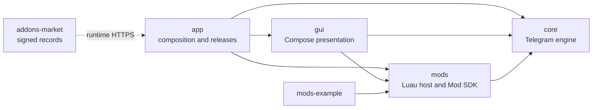
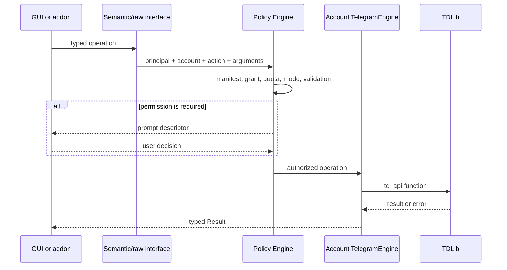
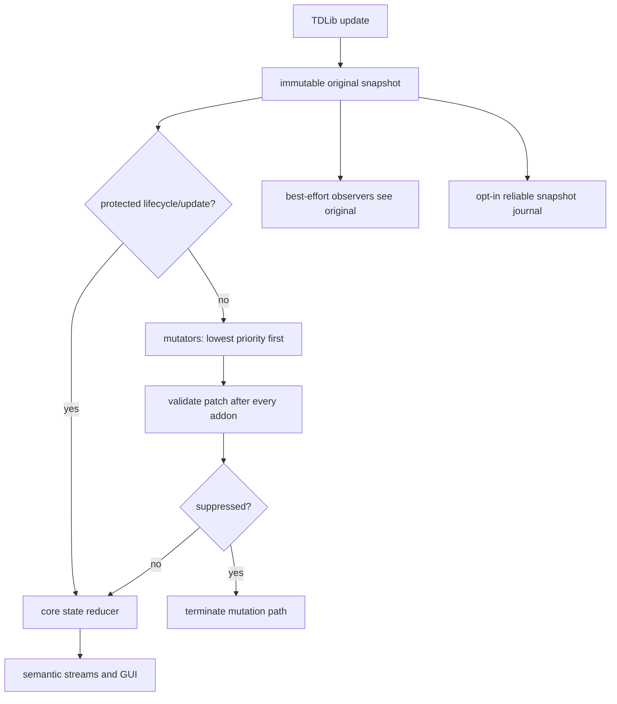

# VibeTGram system architecture

Status: **Accepted for bootstrap**

Baseline date: **2026-08-15**

## 1. Goals

VibeTGram will provide:

- an Android 11+ Telegram client with user-facing parity against a pinned
  Telegram Android revision;
- TDLib as the single MTProto engine;
- a stable semantic interface and a version-pinned raw TDLib interface;
- a replaceable Jetpack Compose GUI using Material 3 Expressive;
- sandboxed Luau addons with Android-style permissions;
- source-reviewed addon distribution from a signed organization registry;
- account, addon, storage, and permission isolation;
- GitHub Releases with verifiable provenance and guarded update channels.

The architecture optimizes for deep modules: callers cross small interfaces
while networking, ordering, persistence, validation, and recovery stay inside
the owning implementation.

## 2. Explicit non-goals

- VibeTGram does not embed a second MTProto client next to TDLib.
- Addons cannot load native code, DEX/JAR files, arbitrary Luau bytecode, or
  executable binaries.
- Addons do not receive Android `Context`, Java reflection, JNI handles, raw
  sockets, arbitrary filesystem paths, TDLib auth keys, FCM tokens, or direct
  access to `ClientManager`.
- Runtime addons cannot replace complete first-party screens. A replacement GUI
  is supplied by replacing the `gui` repository.
- Google Play and F-Droid distribution are outside the initial scope.
- Analytics and automatic crash-report uploads are outside the initial scope.

## 3. Repository seams



The dependency direction is `core <- mods <- gui <- app`, with `app` also
depending directly on each lower repository as the composition root. `core`
must not depend on addon or presentation types. `addons-market` is data fetched
at runtime and is never a compile dependency.

`app` pins `core`, `mods`, and `gui` as HTTPS Git submodules at exact commit IDs
and includes them through a Gradle composite build. CI produces an immutable
**build BOM** containing every submodule commit, public interface version, TDLib
commit/schema hash, Luau/tgcalls commit, toolchain, schema version, application
ID and unsigned artifact digest. After offline signing, the release tool creates
a **release BOM** that binds the build-BOM digest to the signed artifact digest
and signing-certificate fingerprint. The signed update manifest authenticates
the release-BOM digest and URL.

## 4. Core modules

| Module | External interface | Complexity hidden by the implementation |
| --- | --- | --- |
| `core-api` | Immutable domain models, `suspend` operations, ordered `Flow` streams, typed errors | Request correlation, cache policy, retries, pagination and account routing |
| `core-tdlib` | `TelegramEngine` adapter satisfying `core-api` | JNI, `ClientManager`, TDLib lifecycle, encryption, update ordering and generated types |
| `core-raw` | Generated typed TDLib objects behind `RawTelegram` | Schema generation, proxy objects, copy-on-write patches, field validation and compatibility checks |
| `core-policy` | `authorize(principal, action, context)` and auditable decisions | Capability lookup, prompts, quotas, redaction, ToS-sensitive gates and rate limits |
| `core-android` | Ports for key wrapping, notifications, media import/export and lifecycle | Keystore, SQLite, MediaStore, SAF, FCM and foreground execution |
| `core-calls` | Versioned `CallEngine` interface | tgcalls, WebRTC, audio focus, camera/microphone, screen capture and signaling coordination |
| `core-storage` | Account-scoped repositories and transactions | Encrypted database layout, migrations, quotas and cleanup |

`core-api` is pure Kotlin/JVM and contains no `Context`, Activity, Compose, JNI,
or filesystem types. Android and TDLib implementations are adapters injected by
`app`. A fake Telegram adapter is the primary test adapter at this seam.

## 5. TDLib and MTProto

TDLib is the only MTProto engine. It owns auth keys, connections, data-center
migration, update recovery, network retry, local Telegram storage, and update
ordering. VibeTGram never attempts to share TDLib auth material with another
client.

The start pin is:

```text
TDLib 022d60202e446ad1287b9fb68e687c8a0760788b
```

If parity requires a Telegram RPC absent from TDLib:

1. Verify that the pinned TDLib schema truly lacks the feature.
2. Prefer a contribution to upstream TDLib.
3. If the release cannot wait, maintain the smallest possible TDLib patch.
4. Expose a concrete typed function/object through the fork's `td_api.tl`.
5. Regenerate Kotlin and Luau raw types and update `schemaHash`.
6. Classify the new function and every sensitive field in the policy overlay.
7. Add compatibility and state-consistency tests before use.

A generic `invokeRawMtproto(method, payload)` is forbidden. It would bypass
TDLib state invariants and make complete policy classification impossible.

Raw TDLib authorization is not satisfied by one broad grant. The Policy Engine
computes the maximum class across the raw capability, concrete function/update,
all input/output fields, arguments/target context and dangerous combinations.
Any Forbidden element denies the operation; any Critical element requires a
fresh per-operation confirmation. The exhaustive rule is normative in the
[capability matrix](../modding/capability-matrix.md#5-raw-tdlib-capabilities).

## 6. Two-level Telegram interface

### 6.1 Semantic level

The semantic interface is the preferred surface for GUI and addons. It uses
stable VibeTGram concepts such as `ChatRef`, `MessageRef`, `MediaHandle`,
`FileHandle`, `Draft`, and `AccountHandle`. It follows independent SemVer and
hides TDLib constructor churn.

Normal failures are values, not exceptions:

```kotlin
sealed interface TelegramError {
    data object PermissionDenied : TelegramError
    data object NotFound : TelegramError
    data class RateLimited(val retryAfterSeconds: Long) : TelegramError
    data object NetworkUnavailable : TelegramError
    data object Conflict : TelegramError
    data object Unsupported : TelegramError
    data object Cancelled : TelegramError
    data class Upstream(val safeCode: Int, val safeMessage: String?) : TelegramError
}
```

The exact names may change during bootstrap, but error categories and the rule
that routine failures are values are normative.

### 6.2 Raw TDLib level

The raw interface is generated from the exact pinned `td_api.tl`. It is enabled
only when all of these match:

- TDLib commit;
- TDLib reported version;
- normalized schema hash;
- VibeTGram raw generator version;
- addon-declared compatibility range.

Raw objects are typed proxies over immutable originals. Reads do not create a
full Lua table. Writes create copy-on-write field-path patches. A patch cannot
change the TDLib constructor, add unknown fields, alter field types, exceed size
limits, or mutate the original snapshot.

If raw compatibility fails, only the addon's raw features are disabled. Its
semantic features continue when their version range is compatible. Developer
Mode may force a raw version mismatch, but cannot bypass schema validation or
the Policy Engine.

## 7. Request path



The signed addon principal is bound by the host to its verified publisher key,
`lua_State` and account. An unsigned project instead receives a random host
development identity with separate storage/grants/priority. Lua cannot submit a
mod, publisher, development-install or account ID to impersonate another
principal.

## 8. Incoming update path



Addon order follows a Minecraft-style stack controlled by drag and drop. The
top addon runs last and wins when multiple valid patches write the same field.
`requires` is a hard dependency keyed by package ID plus publisher key;
`load_after` is only an initial ordering hint.

Mutation rules:

- Observers see the immutable original.
- Mutators see original plus the current validated result.
- A failed patch is rejected; later addons still run.
- Suppression is a separate capability and is terminal.
- Higher-priority addons cannot restore a suppressed update.
- Authorization state, database encryption state, client closing/closed,
  request correlation, addon identity, permission state, and other policy
  control-plane updates can be observed in redacted form but never mutated.

Synchronous hooks cannot await, perform network or storage I/O, or display a
permission prompt. They run with pre-granted permissions under instruction and
wall-clock deadlines. Timeout returns the original/default result.

## 9. Addon runtime

Luau runs inside the main Android process without native code generation or
JIT. Source is compiled to an internal representation in memory; compiled
bytecode is neither accepted in packages nor persisted as a cache.

Each `(addon, account)` pair owns:

- a separate `lua_State`;
- a custom allocator and hard memory quota;
- an instruction interrupt/watchdog;
- a FIFO async event queue;
- account-scoped permissions, storage, journals and cookies;
- a cancellation scope destroyed on disable/logout.

There is no global Luau instance. Addon code runs only inside an
account-bound principal; zero-account settings UI is host-rendered from the
manifest. `settings.global_safe` writes non-account host-managed values from an
account-bound call and never accepts Telegram-derived data. Inter-addon IPC is
typed and manifest-declared, but its initial contract forbids Telegram-derived
or host-sensitive payloads. Libraries execute inside the consuming addon's
identity and cannot add capabilities.

Memory pressure degrades one addon/account instance at a time: collect safe
caches, run GC, pause async work, unload the state, then disable only the
repeated offender. The Telegram engine is protected before addon convenience.

## 10. Product modes

### Standard mode

- Default state.
- No Luau state, hooks, addon event journals, addon UI, store UI, manual install,
  hot reload, or resource-pack application.
- Installed packages, data, grants and priority order remain encrypted at rest.
- The signed catalog and eligible safe addon updates may still refresh in the
  background; no addon code runs.

### Modification Mode

- Every explicit `off -> on` transition shows the complete risk table and a
  15-second timer.
- The state survives application/device restarts while it remains enabled.
- Enabling unlocks the addon manager, store, manual installation, resource
  packs and runtime.
- Each addon still requests its own permissions.
- Manual publisher-signed packages are labeled unreviewed and have no store
  auto-update. Unsigned projects require Developer Mode and receive a separate
  host-generated development identity that cannot collide with signed data or
  grants.
- Turning the mode off is immediate: states and tasks are cancelled, no timer or
  confirmation is shown, and data is retained.

### Developer Mode

- Requires Modification Mode.
- Unlocked by seven taps on the Mod Runtime version, followed by a separate
  15-second warning and explicit checkbox.
- Enables unsigned packages, local SAF projects, hot reload, and forced raw
  compatibility.
- Forced raw compatibility may override only the declared schema-version match;
  exact function/update/field declarations and current Policy Engine coverage
  remain mandatory. Wildcards remain invalid.
- Does not enable Java/JNI, arbitrary files, native code, raw sockets, auth keys,
  or any sandbox bypass.
- Resets whenever Modification Mode is turned off.
- Unsigned/forced addons stop immediately when it resets and retain their data.

## 11. ToS-sensitive features

The standard client follows ordinary Telegram behavior. Addons that modify read
receipts, online/typing behavior, or ephemeral-content handling are hidden until
Modification Mode is enabled.

They require:

1. the global 15-second Modification Mode gate;
2. a manifest declaration;
3. a clearly labeled `ToS-sensitive` store record;
4. a per-addon grant;
5. per-operation confirmation when the action is classified critical.

The store may list and verify such addons. `verified` means that the exact source
commit and declared behavior were reviewed; it never claims Telegram ToS
compliance. The UI must state that the project-wide `api_id` and user account can
still be restricted.

## 12. GUI

The GUI is Compose-first and replaceable through a versioned `GuiEntryPoint`.
The app knows typed routes and the entry point, not a navigation library.

- `gui` owns screen state holders and transforms domain models into immutable UI
  state.
- `core` owns Telegram use cases and does not know about screens.
- `app` owns composition, lifecycle and adapter selection.
- Alternative GUIs must implement the minimum Mod UI Contract: settings,
  message/chat/profile actions, composer/toolbar actions, badges, dialogs and
  addon-owned declarative screens.
- Runtime addons can extend screens and add routes, but cannot replace the chat
  list, conversation, profile, or other first-party screens.

Theme resolution order is:

1. Material 3 Expressive base tokens;
2. system Dynamic Color, when enabled;
3. selected built-in palette;
4. enabled resource packs from bottom to top priority;
5. terminal accessibility corrections.

Accessibility corrections cannot be overridden. Stable requires TalkBack,
large-font layout, keyboard/D-pad/switch navigation, contrast, reduced motion,
and accessibility tests. Layouts cover phones, tablets, foldables, ChromeOS and
freeform windows.

## 13. Files, media, calls and Mini Apps

Telegram files use TDLib's file lifecycle. Lua receives `FileHandle` and
`MediaHandle`, never `localFile.path`. Import/export crosses SAF or MediaStore
only after a user action. Direct arbitrary filesystem access is forbidden.

Calls use the pinned tgcalls source behind `CallEngine`:

```text
tgcalls 2faee3b5524f54d56c91c2058c00e11c656a74b3
```

Addons never receive native call handles. Camera, microphone, screen capture and
call control remain separately permissioned operations.

Mini Apps use the system Android WebView and the official Telegram Mini Apps JS
surface. A startup broker selects and calls the persisted data-directory suffix
before any component touches `android.webkit` or AndroidX WebKit; an
initialization-order test enforces this. When `MULTI_PROFILE` is available, each Telegram account receives a
separate WebView profile. Without `MULTI_PROFILE`, the broker assigns each
account a collision-resistant opaque `WebView.setDataDirectorySuffix` and binds
that suffix before the first WebView is created in the process. Only that
account may open a Mini App in the process; switching the Mini App owner closes
all WebViews, records the next suffix and requires a controlled process restart.
A startup/suffix mismatch disables Mini Apps fail-closed. Cookie clearing alone
is not accepted as account isolation. Luau addons never receive WebView JS
interfaces or Mini App cookies.

## 14. Accounts and encrypted persistence

Every account owns a TDLib client, database, file directory, encryption key and
event queues. The public interface uses an opaque `AccountHandle`; callers
cannot select an account by guessing a numeric ID.

Each account data key is random and wrapped by Android Keystore. Data is not
available after reboot until the device is first unlocked. Application PIN and
biometric lock protect the UI without preventing background push after that
first unlock.

Android Backup excludes sessions, TDLib databases, keys, addon permissions and
data, journals, FCM tokens, downloaded media and every WebView profile/data
directory. Only non-sensitive UI settings and the list of installed themes may
be considered for backup.

Logging out first blocks Mini Apps and stops the WebView-owning process when
needed, then deletes the account's TDLib database, data key, addon instances,
grants, storage, journals, WebView suffix directory, cache and media after
explicit confirmation. Common addon source packages and safe global settings
remain. Failure to prove WebView-profile deletion leaves a visible pending
cleanup state and Mini Apps disabled; it never reassigns that suffix.

Addon storage is an encrypted namespaced key-value/document database over
core-managed SQLite. Raw SQL is not exposed. Indexes and migrations are declared
in the manifest and enforced under record/size quotas.

## 15. Events and scheduling

Async queues are bounded per `(addon, account)` and FIFO within an account.
State-like events may coalesce. Message creation, editing and deletion events do
not coalesce. Overflow is visible; repeated overflow disables only the affected
instance.

Semantic subscribers choose:

- `best_effort`: bounded in-memory delivery;
- `reliable`: encrypted at-least-once disk journal with stable event ID,
  explicit acknowledgement, TTL and quota.

Reliable records are immutable snapshots captured before core state changes.
They exclude authorization secrets and protected lifecycle events. Revocation
stops new capture; deleting already preserved records is a separate confirmed
operation.

## 16. Push and background execution

The official GitHub build uses FCM with TDLib's encrypted device token mode.
Runtime selection is:

1. official Google Play Services;
2. microG with Device Registration and Cloud Messaging;
3. user-enabled foreground service when FCM registration fails;
4. synchronization on application open if the user declines the service.

The fallback foreground service shows the mandatory persistent notification.
FCM payload encryption is always enabled and has no user-off switch.

## 17. Package/store supply chain

- `.vibemod` contains Luau source only.
- `.vibetheme` contains declarative resources only.
- Packages are signed with Ed25519; unsigned packages require Developer Mode.
- The store downloads a source archive for an exact reviewed commit, normalizes
  it, verifies a canonical tree hash, validates it, and compiles only in memory.
- A publisher key must remain continuous across automatic updates.
- Registry records and revocations are signed by a short-lived delegated key
  rooted in an offline Ed25519 trust anchor.
- Safe auto-updates require unchanged publisher identity, capabilities, domains,
  hooks, dependencies and quotas. Expansion waits for user approval.
- A signed revocation blocks execution in normal mode but preserves source and
  data. Developer Mode can explicitly override after warning.

## 18. Release channels and updates

| Channel | Application ID | Signing/testing policy |
| --- | --- | --- |
| Stable | `org.vibetgram.client` | Offline Stable key, physical release gate, parity complete |
| Preview | `org.vibetgram.client.preview` | Dedicated CI key, CI tests only |
| Nightly | `org.vibetgram.client.nightly` | Dedicated CI key, automatic CI build |

Channels have separate storage, Keystore material, FCM configuration and
authorization. Database transfer between channels is unsupported.

The updater reads a signed manifest, verifies channel, SHA-256 and Android
signing-certificate identity, then hands the APK to the system installer. Silent
installation is forbidden. TDLib database downgrade is not guaranteed; app
database migrations are transactional and failures enter recovery mode with
addons disabled.

## 19. Observability and issue reporting

There is no analytics, Crashlytics, or automatic log upload. FCM is the only
Firebase feature.

Local logs have bounded retention and redact messages, names, usernames, chat
and user IDs, tokens, paths, keys and addon secrets. “Report issue” previews a
sanitized report and opens a prefilled GitHub issue. Confirmed addon faults route
to the repository recorded in the registry; core/unknown faults route to the
VibeTGram issue tracker. The user can change the destination.

## 20. Verification strategy

- Tests cross module interfaces rather than implementation seams.
- `core-api` tests run against fake and TDLib adapters.
- Telegram integration tests use test DC accounts only.
- GUI tests cover state, Compose interaction, screenshots and accessibility.
- Raw schema generation and the policy overlay are exhaustive: a new TDLib
  function or sensitive field without classification fails CI.
- Nightly and Preview are CI-only.
- Stable additionally runs a manual checklist on a dedicated rooted microG
  phone. The app receives no root, SELinux remains Enforcing, and normal Doze
  restrictions remain active.
- A GMS emulator covers the standard FCM path; disabling microG Cloud Messaging
  on the physical phone covers the foreground-service fallback.

## 21. Architecture invariants

The following fail closed and require an ADR to change:

1. TDLib is the only MTProto engine.
2. Addons cannot access Android/Java/JNI/native/filesystem escape hatches.
3. The host, not Lua, binds addon and account identity.
4. Every TDLib function and sensitive field has a policy classification.
5. Lifecycle/control-plane updates cannot be mutated or suppressed.
6. Original update snapshots are immutable.
7. A package never gains capabilities silently during update.
8. Modification Mode off means no addon code or addon journal capture executes.
9. No telemetry or diagnostics leave the device without a user-reviewed action.
10. Stable signing and registry root keys never enter ordinary CI secrets.
11. Stable cannot claim parity without a pinned reference and completed matrix.
12. GUI, addons and raw TDLib never receive Telegram auth keys.
